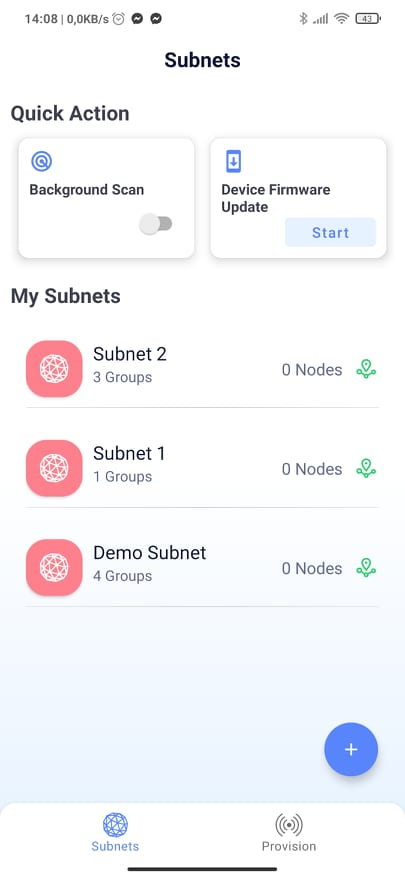
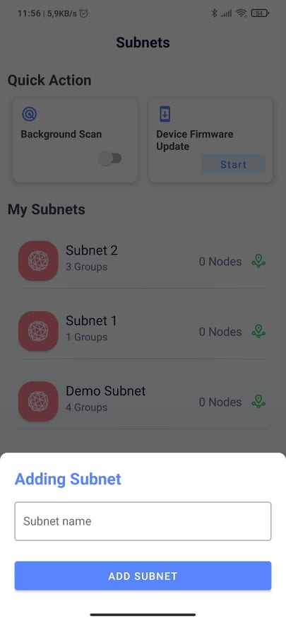
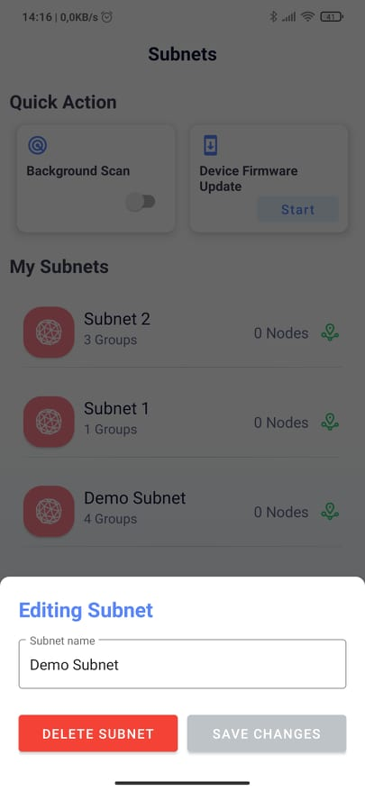
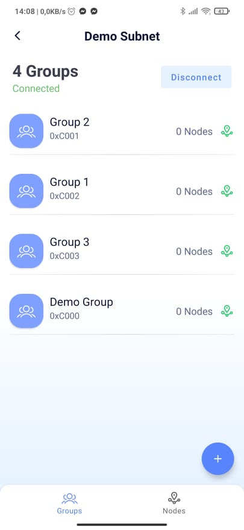
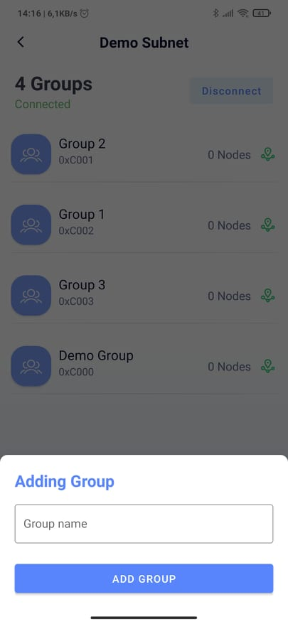
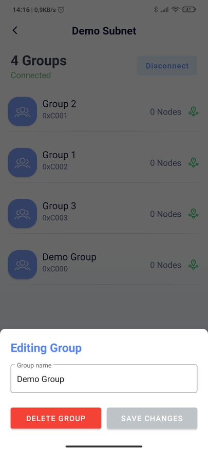
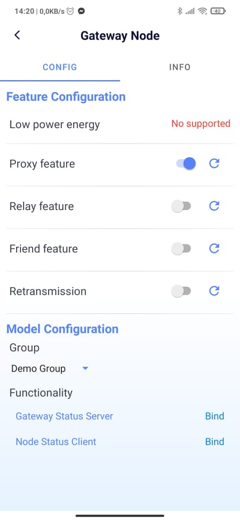
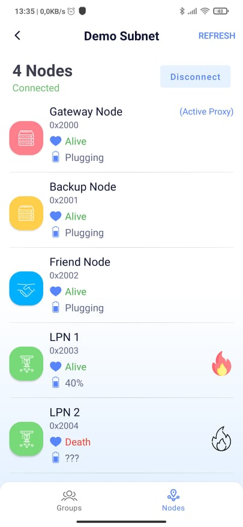
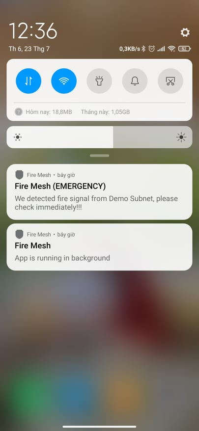
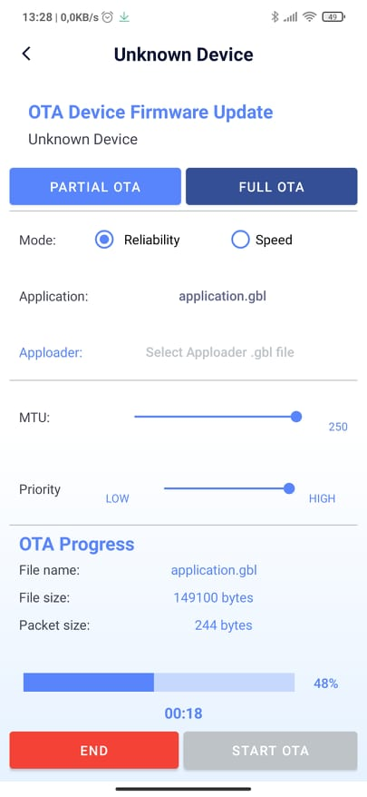

# Fire Mesh Application - Graduation Thesis
1. Subnet Configuration Stage

  
<table>
  <tr>
      <td>Subnet List Feature</td>
    <td>Add Subnet Feature</td>
     <td>Edit Subnet Feature</td>

  </tr>
  <tr>
      <td>   </td>
    <td>   </td>
    <td>   </td>
  </tr>
 </table>

2. Group Configuration Stage

  
<table>
  <tr>
      <td>Group List Feature</td>
    <td>Add Group Feature</td>
     <td>Edit Group Feature</td>

  </tr>
  <tr>
    <td>   </td>
    <td>   </td>
    <td>   </td>
  </tr>
 </table>

3.Provisioning Stage

  
<table>
  <tr>
    <td>Unprovisioned Device List Scan Feature</td>
     <td>Provisioning Device Feature</td>

  </tr>
  <tr>
    <td>   </td>
    <td>   </td>
  </tr>
 </table>

4. Node Configuration Stage

  
<table>
  <tr>
    <td>Node Configuration Feature</td>

  </tr>
  <tr>
    <td>   </td>
  </tr>
 </table>

5. Nodes Status Observer

  
<table>
  <tr>
     <td>Nodes Status Feature</td>
     <td>Background Scan Notification</td>

  </tr>
  <tr>
    <td>   </td>
    <td>   </td>
  </tr>
 </table>

6. OTA Configuration Stage

  
<table>
  <tr>
    <td>OTA Service List Feature</td>
     <td>OTA Device Configuration Feature</td>

  </tr>
  <tr>
    <td>   </td>
    <td>   </td>
  </tr>
 </table>

